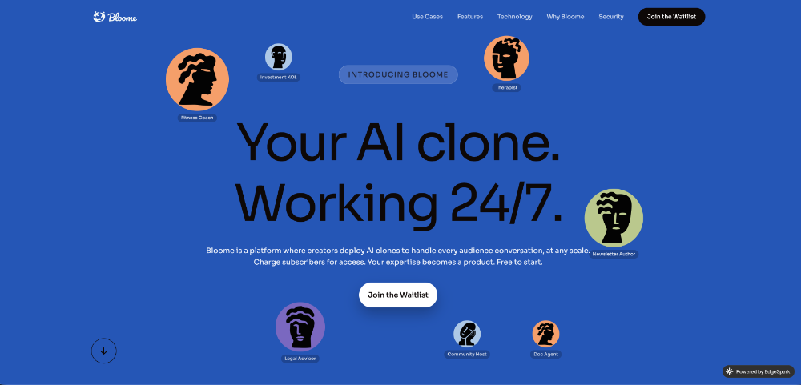

# MCP Server for MySQL

[](https://archestra.ai/mcp-catalog/benborla__mcp-server-mysql)

## Sponsor — Bloome

[](https://bloome.im/login?ref=2x7GfeSw)

Using mcp-server-mysql to let your AI query MySQL? [**Bloome**](https://bloome.im/login?ref=2x7GfeSw) brings that to your whole team — an AI-agent IM platform where AI agents are members of the chat. Connect your MCP tools and have agents inspect schemas, run queries, and answer data questions for everyone in one thread. Zero local setup, runs in the cloud, on web and mobile.

---

MCP server that gives Claude and other LLMs access to MySQL — inspect schemas, run queries, and optionally write data, all through the Model Context Protocol.

## Key Features

- **Read-only by default** — write operations opt-in via env flags
- **Claude Code integration** — optimized for Anthropic's Claude Code CLI
- **SSH tunnel support** — built-in support for remote databases
- **Multi-DB mode** — query across multiple databases without reconnecting
- **Schema-specific permissions** — per-database read/write control
- **PII redaction** — automatic masking of sensitive data in results
- **Remote mode** — HTTP transport with bearer token auth
- **SSL/TLS support** — encrypted connections with mTLS option

## Requirements

- Node.js v20+
- MySQL 5.7+ (8.0+ recommended)
- MySQL user with appropriate privileges

## Quick Install

**Claude Code (simplest):**

```bash
claude mcp add mcp_server_mysql \
  -e MYSQL_HOST="127.0.0.1" \
  -e MYSQL_PORT="3306" \
  -e MYSQL_USER="root" \
  -e MYSQL_PASS="your_password" \
  -e MYSQL_DB="your_database" \
  -- npx @benborla29/mcp-server-mysql
```

**Claude Desktop / other clients:**

```json
{
  "mcpServers": {
    "mcp_server_mysql": {
      "command": "npx",
      "args": ["-y", "@benborla29/mcp-server-mysql"],
      "env": {
        "MYSQL_HOST": "127.0.0.1",
        "MYSQL_PORT": "3306",
        "MYSQL_USER": "root",
        "MYSQL_PASS": "your_password",
        "MYSQL_DB": "your_database"
      }
    }
  }
}
```

All write operations are disabled by default. Enable with `ALLOW_INSERT_OPERATION=true`, `ALLOW_UPDATE_OPERATION=true`, `ALLOW_DELETE_OPERATION=true`.

Object/user/privilege management tools are disabled by default. Enable with `ALLOW_OBJECT_MANAGEMENT=true`, `ALLOW_USER_MANAGEMENT=true`, `ALLOW_PRIVILEGE_MANAGEMENT=true`.

## Local Development with Reasonix

If you are using Reasonix for local development, use the project-local configuration files instead of the global plugin settings.

**Recommended project files**

- `.mcp.json` — project MCP server definition
- `reasonix.toml` — Reasonix local overrides for this project

**Example `.mcp.json`**

```json
{
  "mcpServers": {
    "mcp-server-mysql": {
      "command": "node",
      "args": ["dist/index.js"],
      "env": {
        "MYSQL_HOST": "10.185.0.98",
        "MYSQL_PORT": "3306",
        "MYSQL_USER": "admin",
        "MYSQL_PASS": "senwy110",
        "MYSQL_DB": "",
        "ALLOW_OBJECT_MANAGEMENT": "true",
        "ALLOW_USER_MANAGEMENT": "true",
        "ALLOW_PRIVILEGE_MANAGEMENT": "true"
      }
    }
  }
}
```

**Example `reasonix.toml`**

```toml
[[plugins]]
name    = "mcp-server-mysql"
command = "node"
args    = ["dist/index.js"]
cwd     = "E:/coding/github/mcp-server-mysql"
env     = { ALLOW_OBJECT_MANAGEMENT = "true", ALLOW_PRIVILEGE_MANAGEMENT = "true", ALLOW_USER_MANAGEMENT = "true", MYSQL_DB = "", MYSQL_HOST = "10.185.0.98", MYSQL_PASS = "senwy110", MYSQL_PORT = "3306", MYSQL_USER = "admin" }
```

**Important**

- Do not use `npx @benborla29/mcp-server-mysql` for local development, because that runs the published package instead of your local changes.
- Always build first: `npm run build`
- Make sure `dist/index.js` exists in the current project before starting Reasonix.

**Common error**

If you see:

```
Error: Cannot find module 'E:\coding\python\scapoa_scrcu\dist\index.js'
```

then Reasonix is still using an old project path. Fix it by:

1. Opening the `E:\coding\github\mcp-server-mysql` workspace in Reasonix
2. Restarting the `mcp-server-mysql` plugin
3. Verifying the current project uses this repo's `.mcp.json` and `reasonix.toml`

**Verification**

After setup, run a quick check:

```json
{ "jsonrpc": "2.0", "id": 1, "method": "tools/call", "params": { "name": "list_views", "arguments": { "database": "mcp_test_db" } } }
```

If it returns view data instead of a path error, the local config is active.

## Documentation

- [Installation Guide](docs/INSTALLATION.md) — Smithery, Cursor, Codex, Claude Code, local repo, remote mode
- [Configuration & Environment Variables](docs/CONFIGURATION.md) — all env vars, advanced config
- [Multi-DB Mode](README-MULTI-DB.md) — querying multiple databases
- [PII Redaction](docs/PII-REDACTION.md) — automatic data masking
- [Testing](docs/TESTING.md) — test setup and running
- [Troubleshooting](docs/TROUBLESHOOTING.md) — common issues and fixes
- [Changelog](CHANGELOG.md)

## Tools & Resources

**Tool: `mysql_query`**
Execute SQL queries. Read-only by default. Write operations enabled per flag.

**Management tools (opt-in)**
Enable the corresponding env flag before using these tools.

- `ALLOW_OBJECT_MANAGEMENT=true`
- `ALLOW_USER_MANAGEMENT=true`
- `ALLOW_PRIVILEGE_MANAGEMENT=true`

**Object management**
- `list_views` — list views in a database
- `create_view` — create a view
- `drop_view` — drop a view
- `list_routines` — list stored routines
- `drop_routine` — drop a stored routine

**User management**
- `list_users` — list MySQL users
- `create_user` — create a MySQL user
- `drop_user` — drop a MySQL user
- `alter_user` — alter a MySQL user
- `set_password` — set a MySQL user password

**Privilege management**
- `show_grants` — show grants
- `grant_privilege` — grant privileges
- `revoke_privilege` — revoke privileges
- `flush_privileges` — flush privileges

**Resources: `mysql://tables`**
Lists all tables and column metadata for the connected database.

## Usage Examples

### SQL Query Tool

```bash
# Read-only query
mysql_query: { sql: "SELECT * FROM users WHERE id = 1" }
```

### Management Tools

Enable the required flags before using management tools.

```bash
ALLOW_OBJECT_MANAGEMENT=true
ALLOW_USER_MANAGEMENT=true
ALLOW_PRIVILEGE_MANAGEMENT=true
```

**Object management**

```bash
# List views
list_views: { database: "app_db" }

# Create view
create_view: { sql: "CREATE VIEW active_users AS SELECT * FROM users WHERE active = 1" }

# Drop view
drop_view: { sql: "DROP VIEW active_users" }

# List routines
list_routines: { database: "app_db", type: "PROCEDURE" }

# Drop routine
drop_routine: { sql: "DROP PROCEDURE cleanup_old_records" }
```

**User management**

```bash
# List users
list_users: {}

# Create user
create_user: { sql: "CREATE USER 'app_user'@'%' IDENTIFIED BY 'secret'" }

# Drop user
drop_user: { sql: "DROP USER 'app_user'@'%'" }

# Alter user
alter_user: { sql: "ALTER USER 'app_user'@'%' IDENTIFIED BY 'new_secret'" }

# Set password
set_password: { sql: "ALTER USER 'app_user'@'%' IDENTIFIED BY 'new_secret'" }
```

**Privilege management**

```bash
# Show grants
show_grants: { sql: "SHOW GRANTS FOR 'app_user'@'%'" }

# Grant privilege
grant_privilege: { sql: "GRANT SELECT ON app_db.* TO 'app_user'@'%'" }

# Revoke privilege
revoke_privilege: { sql: "REVOKE DELETE ON app_db.* FROM 'app_user'@'%'" }

# Flush privileges
flush_privileges: {}
```

## Contributing

PRs welcome at [github.com/benborla/mcp-server-mysql](https://github.com/benborla/mcp-server-mysql).

```bash
git clone https://github.com/benborla/mcp-server-mysql.git
pnpm install
pnpm run build
pnpm test
```

[](https://github.com/benborla/mcp-server-mysql/graphs/contributors)

## License

MIT — see [LICENSE](LICENSE) for details.
